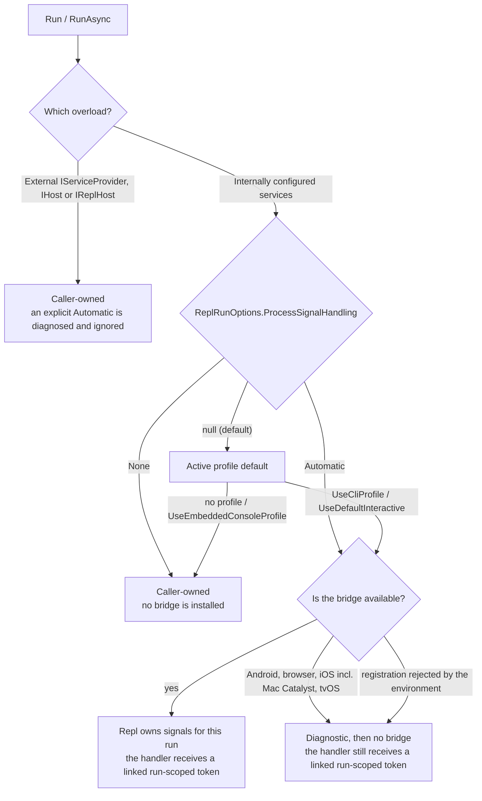
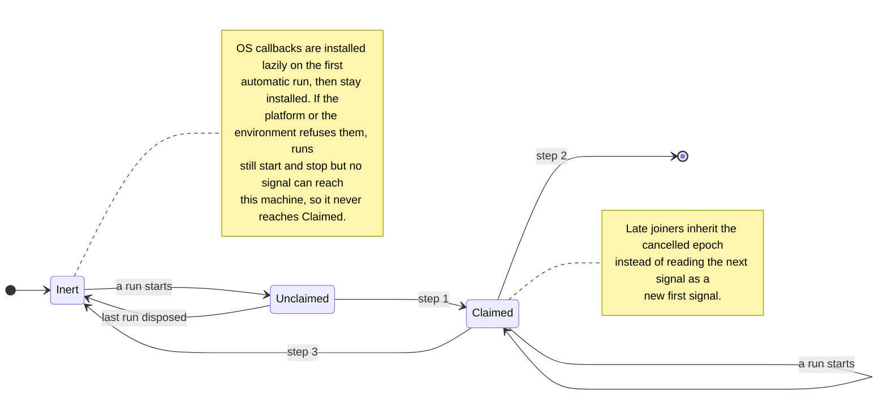
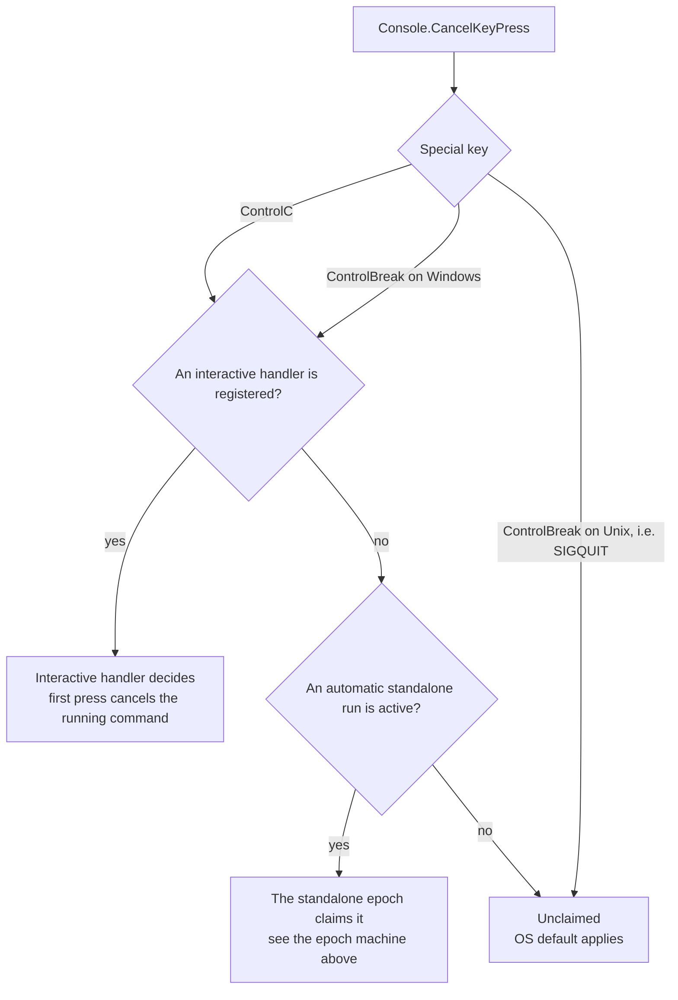

# Configuration Reference

This is the complete configuration reference for the Repl Toolkit. All options are accessible through the `ReplOptions` object passed to `app.Options(...)`.

```csharp
var app = ReplApp.Create();
app.Options(o =>
{
    o.Interactive.Prompt = "$";
    o.Output.DefaultFormat = "json";
    o.Parsing.AllowResponseFiles = false;
});
```

See also: [Commands](commands.md) | [Shell Completion](shell-completion.md) | [Interaction](interaction.md) | [Progress](progress.md)

## ReplOptions

The root configuration object. Exposes the following section properties:

- `Parsing` — Command-line parsing behavior
- `Interactive` — REPL session and prompt settings
- `Output` — Formatting, theming, and rendering
- `Binding` — Parameter binding behavior
- `Capabilities` — Terminal capability declarations
- `AmbientCommands` — Built-in command toggles and custom ambient commands
- `Interaction` — Progress and prompt fallback settings
- `ShellCompletion` — Shell completion installation and behavior

## ParsingOptions

Accessed via `ReplOptions.Parsing`.

- `AllowUnknownOptions` (`bool`, default: `false`) — Allow options not explicitly registered.
- `OptionCaseSensitivity` (`ReplCaseSensitivity`, default: `CaseSensitive`) — Option name case sensitivity.
- `AllowResponseFiles` (`bool`, default: `true`) — Expand response files (`@args.rsp`).
- `NumericCulture` (`NumericParsingCulture`, default: `Invariant`) — Culture used for numeric conversions.

### Methods

- `AddRouteConstraint(name, predicate)` — Register a named route constraint.
- `AddGlobalOption<T>(name, aliases, defaultValue)` — Register a global option available to all commands.
- `AddGlobalOption(name, typeName, aliases, defaultValue)` — Register a global option using a type name string (`"int"`, `"bool"`, `"guid"`, etc.).

### IGlobalOptionsAccessor

Registered automatically in DI. Provides typed access to parsed global option values from middleware, DI factories, and handlers.

- `GetValue<T>(name, defaultValue)` — Get typed value, falling back to registration default then caller default.
- `GetRawValues(name)` — Get all raw string values (supports repeated options).
- `HasValue(name)` — Check if the option was explicitly provided.
- `GetOptionNames()` — Enumerate all option names with values.

Values are updated after each global option parsing pass (per-invocation in interactive mode).

### UseGlobalOptions&lt;T&gt;()

Extension method on `ReplApp`. Registers a typed class whose public settable properties become global options. The class is available via DI, populated from parsed values. Property names are converted to kebab-case (`MaxRetries` → `--max-retries`). See [Commands — Accessing global options](commands.md#accessing-global-options-outside-handlers).

## InteractiveOptions

Accessed via `ReplOptions.Interactive`.

- `Prompt` (`string`, default: `">"`) — REPL prompt text.
- `InteractivePolicy` (`InteractivePolicy`, default: `Auto`) — Controls interactive mode activation: `Auto`, `Always`, or `Never`.
- `HistoryProvider` (`IHistoryProvider?`, default: `null`) — Custom history provider.
- `Autocomplete` (`AutocompleteOptions`) — Nested autocomplete options (see below).

### AutocompleteOptions

Accessed via `ReplOptions.Interactive.Autocomplete`.

- `Mode` (`AutocompleteMode`, default: `Auto`) — Autocomplete activation mode.
- `Presentation` (`AutocompletePresentation`, default: `Hybrid`) — How suggestions are displayed.
- `MaxVisibleSuggestions` (`int`, default: `8`) — Maximum number of visible suggestions.
- `CaseSensitive` (`bool`, default: `false`) — Whether matching is case-sensitive.
- `EnableFuzzyMatching` (`bool`, default: `false`) — Enable fuzzy matching for suggestions.
- `LiveHintEnabled` (`bool`, default: `true`) — Show inline hint while typing.
- `LiveHintMaxAlternatives` (`int`, default: `5`) — Maximum alternatives shown in live hint.
- `ShowContextAlternatives` (`bool`, default: `true`) — Show context-aware alternatives.
- `ShowInvalidAlternatives` (`bool`, default: `true`) — Show invalid alternatives in suggestions.
- `ColorizeInputLine` (`bool`, default: `true`) — Colorize the input line.
- `ColorizeHintAndMenu` (`bool`, default: `true`) — Colorize hints and the suggestion menu.

## OutputOptions

Accessed via `ReplOptions.Output`.

- `DefaultFormat` (`string`, default: `"human"`) — Default output format.
- `AnsiMode` (`AnsiMode`, default: `Auto`) — ANSI color support mode.
- `ThemeMode` (`ThemeMode`, default: `Auto`) — Theme mode: `Auto`, `Light`, or `Dark`.
- `PaletteProvider` (`IAnsiPaletteProvider`, default: `DefaultAnsiPaletteProvider`) — Custom color palette provider.
- `BannerEnabled` (`bool`, default: `true`) — Enable banner output.
- `BannerFormats` (`ISet<string>`, default: `{"human"}`) — Output formats that display banners.
- `ColorizeStructuredInteractive` (`bool`, default: `true`) — Colorize JSON/XML in interactive mode.
- `PreferredWidth` (`int?`, default: `null`) — Preferred render width. `null` uses automatic detection.
- `FallbackWidth` (`int`, default: `120`) — Fallback width when the terminal is unavailable.
- `ResultFlow` (`ResultFlowOptions`) - Paging and large-result behavior.
- `JsonSerializerOptions` (`JsonSerializerOptions`, default: Web defaults + indented) — JSON serializer options.

Built-in transformers: `human`, `json`, `xml`, `yaml`, `markdown`.

### ResultFlowOptions

Accessed via `ReplOptions.Output.ResultFlow`.

- `DefaultPageSize` (`int`, default: `100`) - Page size used when no caller or terminal hint provides one.
- `MaxPageSize` (`int`, default: `1000`) - Maximum accepted page size.
- `ReservedVisibleRows` (`int`, default: `2`) - Rows reserved when computing terminal-visible data rows.
- `DefaultPagerMode` (`ReplPagerMode`, default: `Auto`) - Pager behavior for human formats.
- `PagerRenderers` (`IReadOnlyList<IReplPagerRenderer>`) - Custom interactive pager renderers keyed by pager mode.
- `MaxBufferedLines` (`int`, default: `10000`) - Maximum content lines buffered by interactive viewport pagers.
- `ProgrammaticMaxInlineBytes` (`int`, default: `65536`) - Reserved for programmatic inline payload policy.

Register custom pager renderers with `UsePagerRenderer(renderer)`. Use
`RemovePagerRenderer(mode)` or `ClearPagerRenderers()` to alter the configured
renderer set.

### OutputOptions Methods

- `AddTransformer(name, transformer)` — Register a custom output transformer.
- `AddAlias(alias, format)` — Register a format alias.

## BindingOptions

Accessed via `ReplOptions.Binding`.

- `AggregateConversionErrors` (`bool`, default: `true`) — Aggregate all conversion errors instead of failing on the first.

## CapabilityOptions

Accessed via `ReplOptions.Capabilities`.

- `SupportsAnsi` (`bool`, default: `true`) — Declare whether the terminal supports ANSI escape sequences.

## ExitCodeOptions

Accessed via `ReplOptions.ExitCodes`. Maps each `ReplExecutionOutcomeKind` to the process exit code
of a top-level run; nested MCP sub-invocations always use the defaults and skip the resolver.

- `Success` (`int`, default: `0`) — Success-like handler result or clean interactive exit.
- `Help` (`int`, default: `0`) — `--help`, a bare invocation that prints help, scoped-context help.
- `UsageError` (`int`, default: `2`) — Unknown command, ambiguous prefix, invalid option, context validation failure, unknown output format.
- `BindingError` (`int`, default: `2`) — A handler argument could not be bound: token conversion failed or was missing, or a binder-resolved value (context value, `[FromServices]` dependency, typed global options service) was unavailable.
- `HandlerError` (`int`, default: `1`) — Handler returned an error-like `IReplResult`.
- `HandlerException` (`int`, default: `1`) — Handler or middleware threw.
- `Cancelled` (`int?`, default: `null`) — Cancellation through the caller's own token, during the command or while hosted services were starting. `null` rethrows the `OperationCanceledException` unless a `Resolver` is set, in which case the resolver is handed `130` (`128 + SIGINT`); a value is returned instead. A handler that raises `OperationCanceledException` without the caller having asked for cancellation is a `HandlerException`, not a cancellation.
- `Interrupted` (`int?`, default: `null`) — A process signal (SIGINT, Ctrl+Break, SIGTERM) the framework claimed for a standalone run that opted in through `ReplRunOptions.ProcessSignalHandling`. `null` uses the conventional `128 + signal` code the signal carries (`130` for SIGINT/Ctrl+Break, `143` for SIGTERM), falling back to `130` when none is supplied; setting it publishes one code for every signal. Only a clean or cancelled run is reclassified as interrupted — one that already produced a refusal or failure keeps reporting it.
- `FrameworkError` (`int`, default: `1`) — Incompatible programmatic adapter, unsupported hosting capability, or a hosted-service start/stop failure. The outcome carries the exception that caused it; when a shutdown failure suppressed an exception the run was propagating, that is an `AggregateException` of both. Neither a cancellation nor an interruption falls back to this code.
- `Resolver` (`Func<ReplExecutionOutcome, int>?`, default: `null`) — Final interception hook. Receives the outcome with its table-mapped `ExitCode`; its return value wins. Also sees `HandlerExitCode` outcomes (explicit `Results.Exit`), which bypass the table. `ReplExecutionOutcome.Scope` distinguishes the process exit code (`ReplExitCodeScope.Process`, once per run) from one interactive command's shell-integration mark (`ReplExitCodeScope.ShellIntegrationMark`, only when a mark actually carries a code). Setting a resolver also opts in to observing cancellation. It must not throw: an exception degrades to the table-mapped code plus one diagnostic line on the error stream.

Codes should stay within `0`-`255` — POSIX `wait` exposes only the low eight bits to the parent
process. Repl passes a configured code through unchanged rather than clamping it.

## AmbientCommandOptions

Accessed via `ReplOptions.AmbientCommands`.

- `ExitCommandEnabled` (`bool`, default: `true`) — Enable the built-in `exit` command.
- `ShowHistoryInHelp` (`bool`, default: `false`) — Show the `history` command in help output.
- `ShowCompleteInHelp` (`bool`, default: `false`) — Show the `complete` command in help output.

### AmbientCommandOptions Methods

- `MapAmbient(name, handler, description)` — Register a custom ambient command.

## InteractionOptions

Accessed via `ReplOptions.Interaction`.

These options are configured through `app.Options(...)`. Repl does not currently auto-bind them from `IConfiguration`.

- `DefaultProgressLabel` (`string`, default: `"Progress"`) — Default label for progress indicators.
- `ProgressTemplate` (`string`, default: `"{label}: {percent:0}%"`) — Progress display template. Supports placeholders: `{label}`, `{percent}`, `{percent:0}`, `{percent:0.0}`.
- `AdvancedProgressMode` (`AdvancedProgressMode`, default: `Auto`) — Controls whether compatible hosts emit advanced terminal progress sequences. See [Progress](progress.md#advanced-terminal-progress).
- `PromptFallback` (`PromptFallback`, default: `UseDefault`) — Behavior when interactive prompts are unavailable.

## TerminalIntegrationOptions

Configured through `app.UseTerminalIntegration(...)` (opt-in; no marks are emitted without the call). See [Terminal Shell Integration](terminal-shell-integration.md).

- `ShellIntegration` (`ShellIntegrationMode`, default: `Auto`) — Controls whether shell-integration lifecycle marks (OSC 133 / OSC 633) are emitted around the interactive prompt and command execution.

## ShellCompletionOptions

Accessed via `ReplOptions.ShellCompletion`. See [Shell Completion](shell-completion.md) for setup details.

- `Enabled` (`bool`, default: `true`) — Enable shell completion support.
- `SetupMode` (`ShellCompletionSetupMode`, default: `Manual`) — Completion setup mode.
- `PreferredShell` (`ShellKind?`, default: `null`) — Preferred shell for completion. `null` uses automatic detection.
- `PromptOnce` (`bool`, default: `true`) — Only prompt the user once for completion setup.
- `ProviderTimeout` (`TimeSpan`, default: 1 second) — Deadline applied to each opted-in `WithCompletion` provider on the completion bridge; a stalled provider is abandoned and completion degrades to static candidates.
- `StateFilePath` (`string?`, default: `null`) — Path to the completion state file.
- `BashProfilePath` (`string?`, default: `null`) — Custom path for the Bash profile.
- `PowerShellProfilePath` (`string?`, default: `null`) — Custom path for the PowerShell profile.
- `ZshProfilePath` (`string?`, default: `null`) — Custom path for the Zsh profile.
- `FishProfilePath` (`string?`, default: `null`) — Custom path for the Fish profile.
- `NuProfilePath` (`string?`, default: `null`) — Custom path for the Nushell profile.

## ReplRunOptions

A record passed to `app.RunAsync(...)` to control runtime behavior. Separate from `ReplOptions`.

- `ProcessSignalHandling` (`ProcessSignalHandlingMode?`, default: `null`) — `null` preserves the active application's profile default. Set it to `Automatic` or `None` to override that default for one run. An unprofiled app defaults to caller-owned handling (`None`).
- `HostedServiceLifecycle` (`HostedServiceLifecycleMode`, default: `None`) — Hosted service lifecycle mode.
- `AnsiSupport` (`AnsiMode`, default: `Auto`) — ANSI support mode for this run.
- `TerminalOverrides` (`TerminalSessionOverrides?`, default: `null`) — Terminal session overrides.

### Process signal handling

`ProcessSignalHandling` applies only to standalone `Run`/`RunAsync` overloads that use the app's internally configured services. Overloads that receive an external `IServiceProvider`, `IHost`, or `IReplHost` do not install the standalone process-signal bridge; the external owner remains responsible for translating shutdown into the caller-owned cancellation token. Passing an explicit `Automatic` value to one of those overloads writes a diagnostic to the active error channel and ignores the value. If such a run enters Repl's interactive loop, that loop still retains its own console command-cancellation policy.

The mode that actually applies to a run is resolved in this order:



| Value | Behavior |
|---|---|
| `null` | Inherit the active profile's default. Supplying unrelated options such as `AnsiSupport` does not change signal ownership. |
| `ProcessSignalHandlingMode.Automatic` | Repl temporarily owns standalone process-signal handling and converts a first supported signal into cooperative cancellation. |
| `ProcessSignalHandlingMode.None` | Repl installs no standalone process-signal handling. The caller or host owns shutdown. |

Profile defaults are:

| App configuration | Default | Intended owner |
|---|---|---|
| `ReplApp.Create()` without a profile | `None` | Caller or embedding host |
| `UseCliProfile()` | `Automatic` | Standalone CLI process |
| `UseDefaultInteractive()` | `Automatic` for one-shot runs; the interactive session keeps its existing Ctrl+C behavior | Repl |
| `UseEmbeddedConsoleProfile()` | `None` | Embedding host |

An embedded host can opt in for one run, while a standalone app can opt out:

```csharp
var exitCode = await app.RunAsync(
    args,
    new ReplRunOptions
    {
        ProcessSignalHandling = ProcessSignalHandlingMode.Automatic,
    },
    stoppingToken);
```

```csharp
var exitCode = await app.RunAsync(
    args,
    new ReplRunOptions
    {
        ProcessSignalHandling = ProcessSignalHandlingMode.None,
    },
    stoppingToken);
```

#### First and second signals

Automatic handling supports overlapping standalone runs in one process-wide ownership epoch. The shared OS callbacks are installed lazily once per process and remain inert when no automatic run owns signals; keeping the callbacks stable avoids registration teardown races with runtime callback snapshots.

1. The first supported signal is claimed once, a diagnostic is written to standard error, and every active automatic run receives cooperative cancellation. A run that starts before the last scope from that epoch is disposed joins the already-cancelled epoch rather than interpreting the next signal as another first signal.
2. A subsequent supported signal is not suppressed. Repl writes a final diagnostic and leaves termination to the operating system, so cleanup is not guaranteed to finish.
3. After the last automatic scope is disposed **and all signal-triggered cancellation callbacks have drained**, the process-wide claimed-signal state resets. A run that joins while callbacks are still draining inherits the cancelled epoch.

The epoch is process-wide, so its state is easier to read as a machine than as a list:



The step numbers are the three above. Two edges are worth reading twice: `Claimed --> [*]` is the operating system terminating the process, not Repl returning an exit code; and `Claimed --> Inert` waits on cancellation-callback draining as well as scope disposal, neither of which is bounded. That is deliberate — see the paragraph below the priority rule.

Interactive console-key handling has priority over standalone handling: the first Ctrl+C event—or Ctrl+Break on Windows—during an interactive command cancels that command; a subsequent event, or one with no active command, retains the operating-system default.

One `Console.CancelKeyPress` subscription serves both owners, and which key counts depends on the platform:



Repl does **not** impose an automatic grace-period timeout after the first signal. A non-cooperative handler can therefore keep running until another signal is sent or an external supervisor escalates termination. Cancellation-callback draining is likewise unbounded: resetting the epoch while a callback is still running could cause the next signal to be suppressed as a new first signal. If a callback never completes, the epoch remains claimed and every subsequent supported signal falls through to operating-system termination. This avoids embedding an application-specific shutdown deadline in the library.

#### Exit codes

| Signal/event | Typical source | Exit code | Basis |
|---|---|---:|---|
| `SIGINT` | Ctrl+C | `130` | Unix convention: `128 + 2` |
| `ConsoleSpecialKey.ControlBreak` | Ctrl+Break on Windows | `130` | Repl compatibility policy |
| `SIGTERM` | Service manager, container runtime, or `kill` | `143` | Unix convention: `128 + 15` |
| `SIGQUIT` | Ctrl+\ on Unix, or `kill -QUIT` | `131` | Unclaimed by Repl; whatever the operating system produces |

The `128 + signal number` calculation is a widely adopted Unix shell convention, notably used by Bash. It is not a universal .NET exit-code standard, and POSIX requires signal termination statuses to be distinguishable without requiring this exact arithmetic on every shell and platform. Repl deliberately returns `130` or `143` for predictable Unix CLI, script, container, and supervisor integration.

If a handler completes normally with its own non-zero exit code, that code takes precedence. A successful `0` result or an `OperationCanceledException` caused by the claimed signal resolves to the signal code. Exceptions thrown by consumer cancellation callbacks are observed and diagnosed during scope disposal but do not replace an already-established signal exit code.

#### Platform scope and token lifetime

- Ctrl+C is bridged through `Console.CancelKeyPress`. Ctrl+Break follows the same Repl policy only on Windows. On Unix, .NET surfaces SIGQUIT through `Console.CancelKeyPress` as `ControlBreak`; Repl leaves that event unclaimed so the operating-system SIGQUIT behavior is preserved.
- SIGTERM bridging uses .NET's POSIX signal API and is enabled only on supported non-Windows platforms. SIGTERM does not participate in the interactive console-key priority rule. Repl does not install a direct POSIX SIGQUIT registration. Windows `taskkill`, console-window close, and service-control shutdown do not acquire equivalent SIGTERM semantics from this option; a Windows host must translate its lifecycle events into the caller cancellation token.
- Android, browser, iOS (including Mac Catalyst), and tvOS do not support the required console/POSIX registrations. `Automatic` emits a diagnostic and installs no process-signal bridge there; the platform host must provide cancellation. .NET identifies Mac Catalyst as part of its iOS-like mobile family and compiles the platform-not-supported POSIX signal registration there.
- In `Automatic` mode, a one-shot handler receives a run-scoped token linked to the caller token and the process-signal cancellation source. An interactive command receives a command-scoped token linked to that run token so Ctrl+C can cancel only the active command. Repl disposes each linked token when its scope ends; handlers may use it for awaited work but must not retain it for detached work.
- In `None` mode and external-host overloads, Repl does not create the standalone signal-linked token. A one-shot handler receives the caller token unchanged. An interactive command still receives its separate command-scoped linked token, so its identity and lifetime differ from the caller token even though host-shutdown cancellation flows through it.
