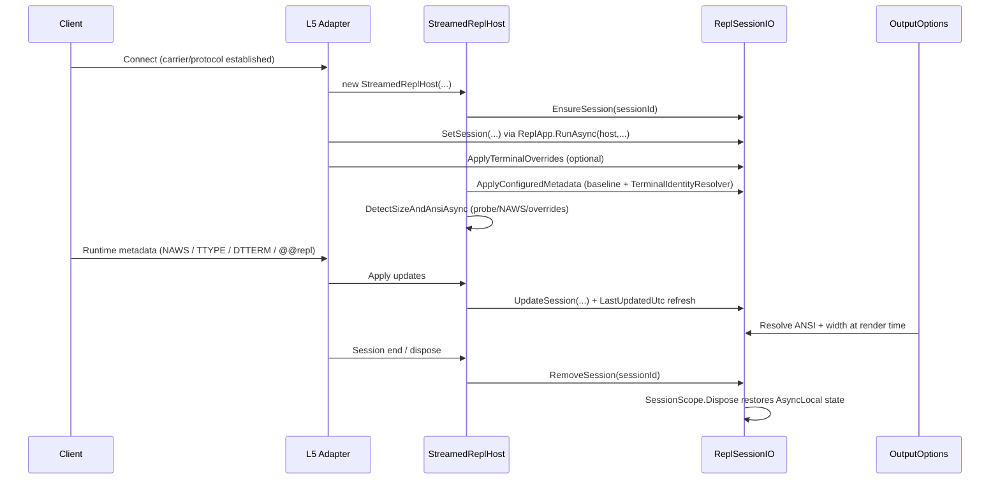

# Terminal Metadata: Protocol Boundaries, Lifecycle, and Precedence

This file is the canonical behavior document for terminal/session metadata in Repl Toolkit.

## Boundary model (A-D) with real OSI references

| Alias | Real OSI layer(s) | Scope in this project | Notes |
|---|---|---|---|
| A | L4 Transport | Carrier substrate | Examples: TCP. WebSocket is not L4. |
| B | L7 Application protocol | Wire protocol spoken over the carrier | Examples: Telnet, HTTP, WebSocket, SignalR protocol. |
| C | In-process runtime state (no direct OSI layer) | REPL metadata state and adapter plumbing | `ReplSessionIO`, `StreamedReplHost`, `IReplSessionInfo`. |
| D | L7 Application convention | App-level metadata conventions carried in text payloads or connect metadata | `@@repl:*`, sample query metadata. |

| Clarification | Value |
|---|---|
| WebSocket layer | L7 (RFC 6455), typically over HTTP/TCP |
| Telnet layer | L7 protocol; can run over any carrier the app provides |
| SignalR layer | L7 protocol/convention (no IETF RFC) |

## Standards and protocol references

| Mechanism | Standard reference | Where used in project |
|---|---|---|
| Telnet base protocol | RFC 854 | `src/Repl.Telnet/TelnetFraming.cs` |
| Telnet option negotiation framework | RFC 855 | `src/Repl.Telnet/TelnetFraming.cs` |
| Telnet NAWS (window size) | RFC 1073 | `src/Repl.Telnet/TelnetFraming.cs`, `src/Repl.Telnet/NawsWindowSizeProvider.cs` |
| Telnet TERMINAL-TYPE | RFC 1091 | `src/Repl.Telnet/TelnetFraming.cs` |
| WebSocket | RFC 6455 | `src/Repl.WebSocket/ReplWebSocketSession.cs` |
| ANSI/VT control grammar | ECMA-48 | `src/Repl.Defaults/VtKeyReader.cs` parsing path |
| DTTERM pushed resize (`CSI 8 ; rows ; cols t`) | De-facto terminal control sequence (xterm-style window ops) | `src/Repl.Defaults/VtKeyReader.cs`, `src/Repl.Defaults/DttermWindowSizeProvider.cs` |
| SignalR protocol | Vendor spec (Microsoft) | sample adapter `samples/05-hosting-remote/ReplHub.cs` |

## Metadata field inventory (source of truth state)

| Field | Stored in `ReplSessionIO.SessionMetadata` | Primary consumer |
|---|---|---|
| `SessionId` | yes | correlation/session lookup |
| `AnsiSupport` | yes | `OutputOptions.IsAnsiEnabled()` |
| `WindowSize` | yes | `OutputOptions.ResolveRenderWidth()` |
| `TransportName` | yes | `IReplSessionInfo.TransportName` |
| `RemotePeer` | yes | `IReplSessionInfo.RemotePeer` |
| `TerminalIdentity` | yes | `IReplSessionInfo.TerminalIdentity` |
| `TerminalCapabilities` | yes | `IReplSessionInfo.TerminalCapabilities` |
| `LastUpdatedUtc` | yes | diagnostics/debugging freshness |

## Parsing and application points by source

| Source | Parsed at | Not parsed at | Fields that can change |
|---|---|---|---|
| `TerminalSessionOverrides` | `ReplApp.ApplyTerminalOverrides` | n/a | `TransportName`, `RemotePeer`, `TerminalIdentity`, `TerminalCapabilities`, `AnsiSupported`, `WindowSize` |
| Adapter baseline (`StreamedReplHost`) | `StreamedReplHost.ApplyConfiguredMetadata` | n/a | `TransportName`, `RemotePeer`, `TerminalIdentity` (via resolver), initial capabilities |
| `TerminalIdentityResolver` | `StreamedReplHost.ApplyConfiguredMetadata` | anywhere else | `TerminalIdentity` and inferred capabilities |
| DTTERM pushed resize | `VtKeyReader` -> `DttermWindowSizeProvider.NotifyResize` -> `StreamedReplHost.OnSizeChanged` | `ReplTelnetSession` framing path | `WindowSize`, `ResizeReporting` |
| Telnet `NAWS` | `TelnetFraming.HandleSubnegotiation` -> `NawsWindowSizeProvider` | `ReplWebSocketSession` | `WindowSize`, `ResizeReporting` |
| Telnet `TERMINAL-TYPE` | `TelnetFraming.HandleSubnegotiation` -> `TerminalTypeChanged` | `ReplWebSocketSession` | `TerminalIdentity`, inferred capabilities |
| `@@repl:*` | `ReplWebSocketSession.ReceiveLoopAsync`, sample `ReplHub.OnInput` | `ReplTelnetSession` package path | `TerminalIdentity`, `WindowSize`, `AnsiSupported`, `TerminalCapabilities` |
| Sample query metadata | sample `Program.cs` + sample `ReplHub.cs` | framework core packages | same as `@@repl:*` payload subset |

## Carrier/framing separation matrix

| Framing/adapter component | L4 carrier examples | L7 protocol used by adapter | Native terminal metadata channel | `@@repl:*` support in that path |
|---|---|---|---|---|
| Local console host path | console process I/O | console host semantics | console/env heuristics | no |
| `ReplWebSocketSession` | TCP | WebSocket | DTTERM pushed resize (in-band text) | yes |
| `ReplTelnetSession` | any supported carrier (`IDuplexPipe`, `Stream`, `WebSocket` adapter) | Telnet | NAWS + TERMINAL-TYPE | no in package |
| sample `ReplHub` adapter | TCP | SignalR | DTTERM pushed resize (in-band text sent by client) | yes in sample |

## Temporal pipeline (ordered behavior)

| Order | Event | Implementation point | Deterministic rule |
|---|---|---|---|
| 1 | Session record creation | `ReplSessionIO.EnsureSession` | creates/keeps dictionary record keyed by `SessionId` |
| 2 | AsyncLocal activation | `ReplSessionIO.SetSession` | sets current input/output/key/session context |
| 3 | Explicit startup overrides | `ReplApp.ApplyTerminalOverrides` | override values written before runtime updates |
| 4 | Adapter baseline injection | `StreamedReplHost.ApplyConfiguredMetadata` | baseline transport/peer/identity applied |
| 5 | Initial detection/probe | `StreamedReplHost.DetectSizeAndAnsiAsync` | first effective size/ansi chosen |
| 6 | Runtime in-band/out-of-band updates | telnet/dtterm/`@@repl` paths | update semantics per field table below |
| 7 | Render-time read | `OutputOptions` | uses current session values when active |
| 8 | Session cleanup | `StreamedReplHost.DisposeAsync` + `SessionScope.Dispose` | removes session record and restores previous AsyncLocal state |

## Session lifecycle and cleanup guarantees

| API/state transition | Dictionary effect (`s_sessions`) | AsyncLocal effect | Exception behavior |
|---|---|---|---|
| `EnsureSession(sessionId)` | add if missing | none | idempotent add semantics |
| `SetSession(output,input,...)` | ensures record exists | pushes current scope values | `using`/`Dispose` pattern restores prior scope even on exceptions |
| `UpdateSession(sessionId, updater)` | add-or-update | none directly | `NormalizeSession` always refreshes `LastUpdatedUtc` |
| `RemoveSession(sessionId)` | remove key if present | none directly | no-throw remove semantics |
| `SessionScope.Dispose()` | optional remove when scope owns generated id | restores previous `Output`, `Input`, `KeyReader`, `SessionId` | always executed in `using` unwind path |

| Ownership case | `removeSessionOnDispose` | Cleanup owner |
|---|---|---|
| Auto-generated id in `SetSession` | true | `SessionScope.Dispose` |
| External host id passed to `SetSession` | false | host lifecycle (`StreamedReplHost.DisposeAsync`) |

## Conflict and precedence rules (runtime truth)

| Field | Startup precedence | Runtime conflict rule | Effective behavior under conflict |
|---|---|---|---|
| `TransportName` | overrides -> adapter baseline | rarely updated at runtime | last write if runtime write occurs |
| `RemotePeer` | overrides -> adapter baseline | rarely updated at runtime | last write if runtime write occurs |
| `TerminalIdentity` | overrides -> resolver | latest non-empty runtime write wins | value replaced; inferred capabilities OR-merged |
| `WindowSize` | overrides -> provider initial size | latest positive runtime write wins | last processed event wins |
| `AnsiSupported` | overrides -> `AnsiMode` resolution | latest explicit runtime write wins | boolean replaced |
| `TerminalCapabilities` | overrides initial set | runtime updates OR-merged | additive flags over time |

| Same-time conflict example | Actual outcome |
|---|---|
| DTTERM reports `80x24`, then `@@repl:hello` reports `120x40` | `120x40` if processed last |
| `@@repl:hello` processed, then resize event processed | resize value wins for size; capabilities remain OR-merged |

## Console/non-session path behavior

| Condition | Metadata visibility | Width behavior | ANSI behavior |
|---|---|---|---|
| `ReplSessionIO.IsSessionActive == false` | session metadata getters return null/default | `OutputOptions`: preferred width -> `Console.WindowWidth` -> fallback | `OutputOptions`: `AnsiMode` + environment/host checks |
| `ReplSessionIO.IsSessionActive == true` | session metadata used | `OutputOptions` uses session `WindowSize` when valid | `OutputOptions` prefers session `AnsiSupport` when set |

## Error handling and fallback behavior

| Input condition | Parsing result | Runtime behavior |
|---|---|---|
| `@@repl:*` malformed JSON | `TerminalControlProtocol.TryParse` returns false | payload is treated as normal user input in websocket/sample-signalr paths |
| `@@repl:*` unknown verb | parse returns false | payload is treated as normal user input |
| `@@repl:hello` with invalid `capabilities` string | parse succeeds; capabilities resolve to `None` | other valid fields still applied |
| `@@repl` payload missing/invalid `cols`/`rows` | no valid `WindowSize` in message | size unchanged |
| Telnet NAWS not received before timeout | `NawsWindowSizeProvider.GetSizeAsync` returns null | startup size unknown; later NAWS events still update |

## Rendering integration (not separate from pipeline)

| Render decision | Data source order | Code path |
|---|---|---|
| ANSI enabled? | session `AnsiSupport` -> `OutputOptions.AnsiMode` -> environment/host checks | `OutputOptions.IsAnsiEnabled` |
| Width for human rendering | preferred width -> session `WindowSize.Width` -> console width -> fallback | `OutputOptions.ResolveRenderWidth` |

## Policy

| Priority | Source class | Prescriptive rule |
|---|---|---|
| 1 | Native protocol signals (Telnet NAWS/TERMINAL-TYPE, DTTERM pushed resize) | preferred when available |
| 2 | Explicit host overrides/baselines | preferred for deterministic startup metadata |
| 3 | `@@repl:*` extension | use only when native signals do not cover required metadata |
| 4 | Out-of-band connect metadata | keep as integration-specific fallback |
